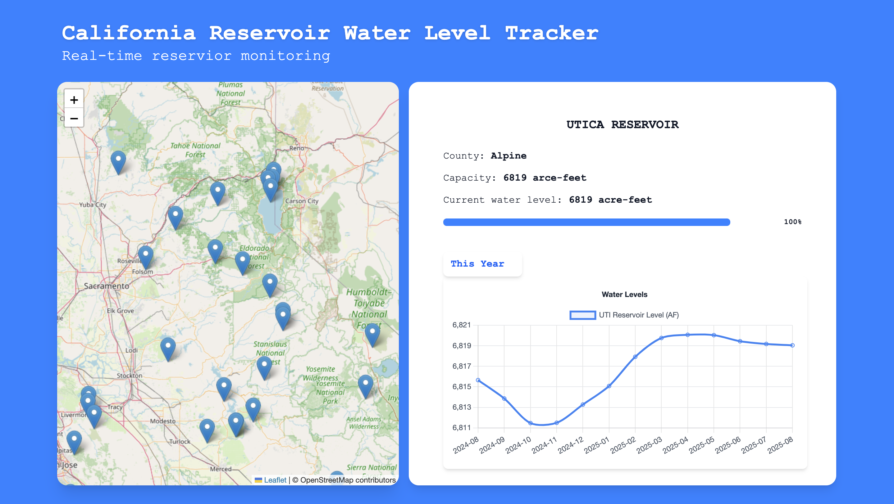

# 💧 California Reservoir Water Level Tracker

A web application that displays **real-time water levels** of California’s reservoirs using interactive charts and maps.
This app combines **real-time data**, **interactive maps**, and **visual analytics** to give a complete picture of California’s water resources. Whether you're a researcher, environmentalist, policymaker, or just a curious resident, this tool makes it easy to explore reservoir conditions from anywhere.

Built with:
- **React** – Frontend framework
- **Chart.js** – Interactive data visualization
- **Leaflet** – Interactive maps for reservoir locations

---

## 📸 Preview

---

## ✨ Features

- **Real-time Reservoir Data** – Fetches up-to-date water level data.
- **Interactive Map** – View reservoir locations using Leaflet.
- **Dynamic Charts** – Visualize reservoir trends with Chart.js.
- **Responsive Design** – Works on desktop and mobile devices.

---

## 🛠 Tech Stack

- **Frontend**: [React](https://reactjs.org/)
- **Charts**: [Chart.js](https://www.chartjs.org/)
- **Maps**: [Leaflet](https://leafletjs.com/)
- **Styling**: CSS / Tailwind (optional if used)
- **Data Source**: California Data Exchange Center (CDEC) API

---
